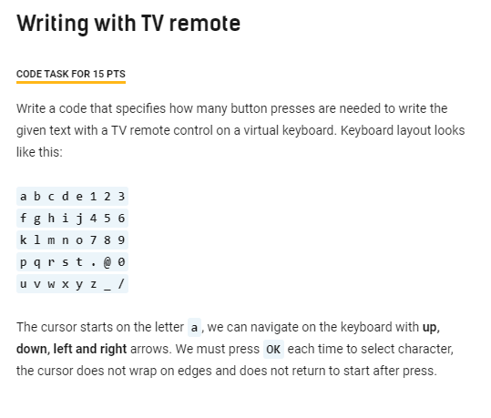
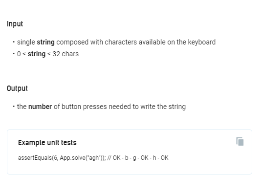
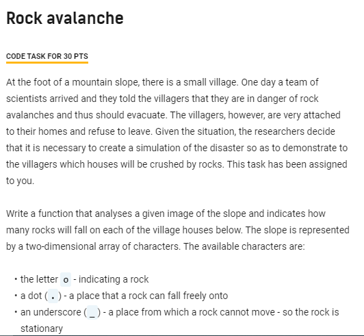
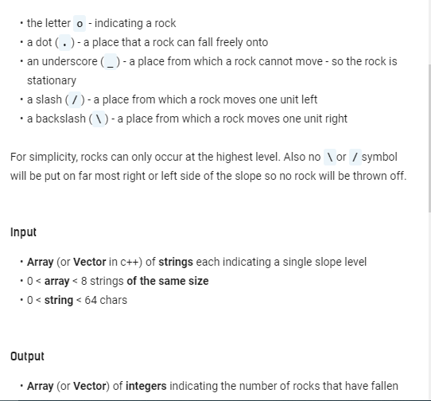
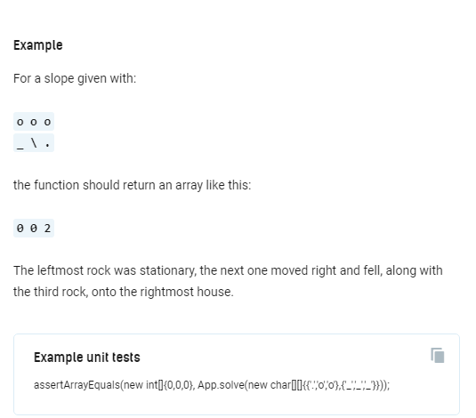
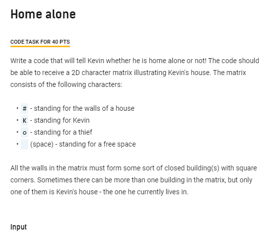
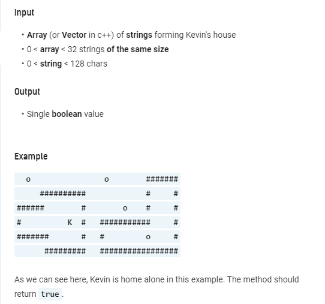
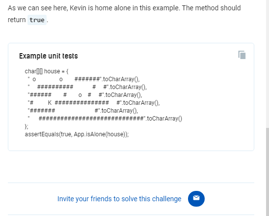

# EricssonCodeTestPrivRepo
Ericsson Coding Test consisting of 3 tasks

Program can be run using jar inside `target` folder using example arguments:

`java -jar target/EricssonCodeTest_complete_standalone.jar ...`
1. `remote test agh`
2. `ooo _\.`
3. `"  o             o       #######"
"    ##########          #     #"
"#####        #      o   #     #"
"#          K # ##########     #"
"######       # #        o     #"
"     ######### ################"`

### 1. Tv Remote

### 2. Rock Avalanche

### 3. Kevin Home Alone

